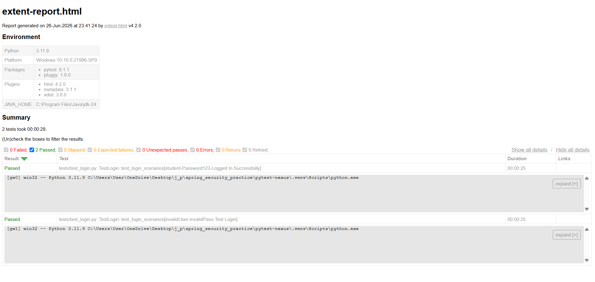

# PyTest-Nexus: Hybrid Test Automation Framework

## Overview
A modular, hybrid test automation framework designed for cross-browser UI testing. Built using Python, Selenium WebDriver, and PyTest (TestNG equivalent), this framework demonstrates robust end-to-end testing capabilities, data-driven testing, and automated HTML reporting.

## Technologies Used
* **Language:** Python 3
* **Automation Tool:** Selenium WebDriver
* **Test Framework:** PyTest
* **Design Pattern:** Page Object Model (POM)
* **Reporting:** pytest-html (ExtentReports equivalent)

## Key Features
* **Data-Driven Testing:** Utilizes `@pytest.mark.parametrize` to execute scenarios with multiple datasets (e.g., valid and invalid credentials).
* **Modular Setup/Teardown:** Implements Pytest fixtures (`conftest.py`) for efficient browser management.
* **Parallel Execution:** Configured to run tests in parallel using `pytest-xdist` to reduce execution time.
* **Automated Reporting:** Generates a self-contained HTML report upon test execution.

## 📊 Execution Dashboard

Here are the automated HTML reports generated after running the test suite:

### Overview Dashboard

## How to Run
1. Clone the repository.
2. Install dependencies: `pip install -r requirements.txt`
3. Execute tests and generate the report: `pytest`